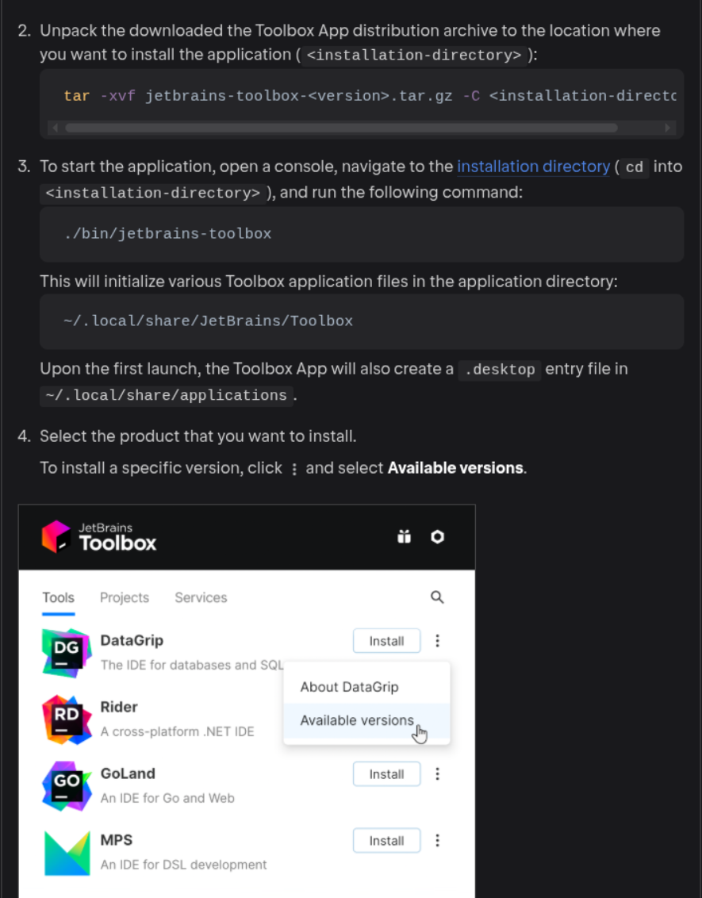

# gnome-jetbrains-toolbox-app

- In this project, I'm just installing the Toolbox based on the JetBrains documentation; this is just a hobby of mine.
- current version: `toolbox-3.6.2.85969`

## install

- download the [toolbox tar.gz file](https://www.jetbrains.com/help/datagrip/installation-guide.html#toolbox_linux)

```sh
sudo mkdir -p /opt/jetbrains-toolbox-app
sudo tar -xvf jetbrains-toolbox-3.6.2.85969.tar.gz -C /opt/jetbrains-toolbox-app
```

- create the symbolic link and run `jetbrains-toolbox` 

```sh
sudo ln -s /opt/jetbrains-toolbox-app/bin/jetbrains-toolbox /usr/sbin/jetbrains-toolbox
```

- in your terminal, run `jetbrains-toolbox` so that it creates the default folders. 
- after verifying this folder, temporarily close JetBrains-Toolbox.

```sh
jetbrains-toolbox
```

- after running JetBrains-Toolbox for the first time, check the `~/.local/share/JetBrains/`

```sh
ls -l ~/.local/share/JetBrains/
```



- now use the `GNOME menu`, and you'll see the JetBrains Toolbox icon.
- if this program won't close, use the `pkill` command to close it from the terminal

## references

- check out [installation guide toolbox for linux](https://www.jetbrains.com/help/datagrip/installation-guide.html#toolbox_linux)
